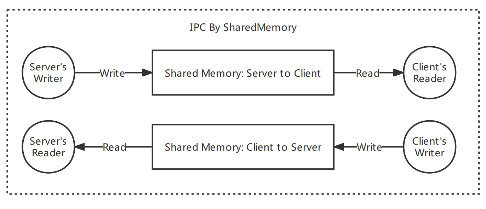

# IPCBySharedMemory

# 适用场景

适用于P2P点对点的进程间通信场景，一对多和多对多的场景暂未支持。


适用平台：`Windows x64 | x86`

IDE：`VS2017`


# 原理简述

通过两块共享内存，每块共享内存负责一个方向的通信，两块共同组成全双工双向通信。



1. 每个Reader或Write均使用一个单独的线程，服务端和客户端分别持有一个读线程和一个写线程，双侧共计4个线程
2. 使用`信号量`作为同步机制
3. 使用`原子变量`和`条件变量`实现线程`挂起/唤醒`机制


# 内存分布

```
// 共享内存分布
// |--初始化标志--|------本次写入长度-------|---------本次写入消息缓存数据---------|
// |-flag(char)-|-writeLen(unsigned int)-|-writeBuf(bufsize * sizeof(char))-|
```


# 注意事项

共享内存默认由服务端创建，因此在使用时必须先初始化`ShmIPCServer`对象再初始化`ShmIPCClient`对象，否则会引起程序断言。